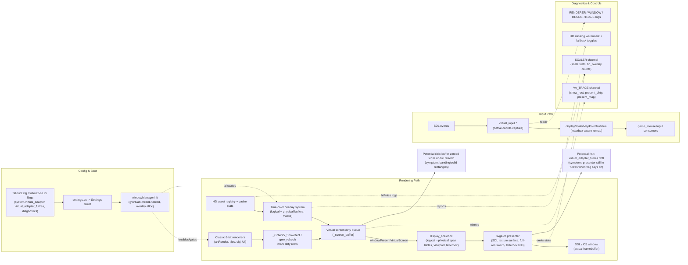

# Virtual Adapter Roadmap

> Because sometimes the wasteland deserves UHD without angering the ancient 640x480 spirits.

## Mission Statement (Why This Exists)
We’re building a virtual 640x480 “vault” so the classic 8-bit engine can keep living in its comfy bunker while the outside world enjoys HD textures, modern input scaling, and future shaders. This roadmap tracks every step required to decouple original rendering/input from the real window, translate everything through the adapter, and eventually layer in crisp RGBA assets without breaking retro compatibility.

## Before You Dive In
1. **Read the whole scroll:** skim each stage below so you know what’s already complete (✅) and which TODO callouts still need love.
2. **Boot with the flag on:** set `system.virtual_adapter=1` and confirm `gVirtualScreenEnabled` lights up in diagnostics before touching code—most tasks assume the virtual surface is active.
3. **Trace the touchpoints:** familiarize yourself with `window_manager`, `display_scaler`, `renderPresent`, `input`, and `art` since every stage hooks one or more of these subsystems.
4. **Log obsessively:** enable the `SCALER` diagnostics channel while testing; every stage adds new log lines that make regression hunting survivable.
5. **Document the fallout:** whenever you land a step, update the corresponding notes/TODOs here so the next scavenger knows which traps were already disarmed.

## Using the Adapter Right Now
1. **Flip the Pip-Boy toggle:** set `system.virtual_adapter=1` inside `fallout2.cfg` (or use the in-game settings page once we wire it up). Leave it at `0` if you need stock behavior for regression testing.
2. **Rebuild once:** the flag is read during startup, so restart the game after editing the cfg. If you’re hacking on the engine, make sure `window_manager` picks up the new value during `windowManagerInit`.
3. **Verify the vault door opened:** enable `diagnostics=SCALER` in `fallout2-ce.ini` and check the log for lines mentioning `gVirtualScreenEnabled=1` and the expected `640x480` pitch. You can also drop a breakpoint on `windowGetVirtualScreenBuffer` and inspect `_screen_buffer_pitch` to be sure the off-screen surface is serving frames.
4. **Know the temporary limits:** true-color overlays are stubbed out in Stage 1.1, so any modules calling `windowHasTrueColorOverlay` or `artGetTrueColorFrame` will get safe defaults until the HD compositor lands in Stage 4.

## Stage 1 – Establish the Vault (Virtual Surface) 
- [x] **S1.1** Spin up an off-screen 640x480 back buffer that mirrors the existing pipeline (palette, blits, everything).
	- Reuse the existing `displayScalerInit(640, 480)` contract so all callers still query logical dimensions through `displayScalerGetLogicalBounds`.
	- Allocate the "virtual" surface directly inside `window_manager` next to the legacy window buffers so 8-bit drawing code keeps working.
	- Gate the behavior behind `system.virtual_adapter=1` (stored in `fallout2.cfg`) so we can flip the layer on without impacting default installs.
	- **Implementation notes:** `_screen_buffer` now doubles as the virtual surface, `_screen_buffer_pitch` records its stride, and `windowGetVirtualScreenBuffer/Pitch` expose it to the rest of the engine. Compatibility shims for the old true-color APIs live in `window_manager` and `art` so downstream systems compile while we re-route rendering.
	- **Usage reminder:** the feature is opt-in; double-check the cfg flag before reporting bugs.
- [x] **S1.2** Wrap `renderPresent`/`window_manager_private` so the old buffer never hits the OS directly.
	- Hook the tail of `windowRefreshAll`/`renderPresent` so it blits the virtual surface into an intermediate texture instead of the physical window.
	- Keep the `display_scaler` letterboxing math so our composite honors integer scaling and logical bounds automatically.
	- **Implementation notes:** `windowPresentVirtualScreen()` now drains the dirty-rect queue produced by `_GNW_win_refresh`, copies the affected slice of `_screen_buffer` into the SDL texture surface, and emits a `SCALER` trace line with the blitted bounds. `_refresh_all`, `windowRefresh*`, and `renderPresent` all call the helper, so nothing touches the OS backbuffer until the virtual present runs.
- [x] **S1.3** Mirror that buffer into a modern RGBA texture for the real window and prove we can scale it cleanly.
	- Use the SDL/DirectDraw presenter we already have: promote the copy step to 32-bit (`bufferToTexture` style) so later stages can mix HD overlays.
	- Instrument diagnostics (category `SCALER`) to log both virtual and physical dimensions for troubleshooting.
	- **Implementation notes:** `windowPresentVirtualScreen()` now copies the dirty rect from `_screen_buffer` straight into the ARGB8888 SDL texture surface via `blitIndexedRectToTexture`, using the shared palette cache that `directDrawSetPalette*` maintains. Every flush logs `virtual_present virtual=(...) viewport=(...)` so we can correlate 640×480 updates with the physical letterboxed viewport.

## Stage 2 – Tame the Rad-Input (Coordinate Translation)
- [x] **S2.1** Capture actual window inputs at native resolution (mouse, wheel, touch).
	- **Implementation notes:** `_GNW95_process_message` now funnels **every** SDL mouse/touch packet into `virtualInputCaptureEvent`, which caches native window coordinates plus wheel deltas the moment they arrive. The new `virtual_input.*` shim resets alongside `mouseDeviceAcquire`, so the Vault Dweller’s cursor always starts fresh after focus changes.
- [x] **S2.2** Normalize and remap to 640x480 coordinates before they reach `game_mouse` / `input`.
	- **Implementation notes:** `displayScalerMapPointToVirtual()` centralizes physical→vault math (letterbox padding, clamps, inverse scale). `mouseDeviceGetData` consumes it for delta math and publishes `VirtualMouseMappingSample`s so downstream systems see the same 640×480 truth as the diagnostics overlay.
- [x] **S2.3** Add diagnostics switches to visualize both coordinate spaces for sanity checks.
	- **Implementation notes:** Flip `[debug] debug_input_overlay=1` in `fallout2.cfg` to summon the Neon Overseer Overlay—red crosshairs track raw physical hits, green marks the remapped vault coords, and the viewport outline glows teal. Everything renders just before `SDL_RenderPresent`, so what you see is exactly what the wasteland gets.

## Stage 3 – Scout the Draw Calls
- [x] **S3.1** Instrument `artRender`/tile/UI paths to log which fid, frame, and layer rendered where in the virtual buffer.
	- **Implementation notes:** `render_trace.cc` now taps `artRender`, tile floors/roofs, and both `_obj_render_pre_roof` / `_obj_render_post_roof` so every blit reports a `RenderTraceOp` with fid, frame, rotation, elevation, and the resolved screen rect (thanks to the new `windowResolveBufferRect` helper). Each op lands in the `RENDERTRACE` diagnostics channel with its depth bucket for forensic spelunking.
- [x] **S3.2** Define a lightweight render-command stream (fid, screen rect, depth bucket).
	- **Implementation notes:** The adapter keeps a per-frame ring buffer (4K ops) of `RenderTraceOp` structs and commits it right before `renderPresent`. Overflow toggles a per-frame flag so we can spot stressed scenes before Stage 4 swaps in HD sprites.
- [x] **S3.3** Validate that the command stream matches the on-screen order in tricky scenes (combat, dialogue, UI overlays).
	- **Implementation notes:** Hitting `Ctrl+F8` spawns the Overseer Replay Window—a 320×240 overlay that replays the last frame’s command stream with color-coded rectangles per layer. Toggle it on/off to eyeball ordering without pausing the action; the hotkey is consumed inside `input.cc` so gameplay never sees the chord.

## Stage 4 – Deploy HD Overlays
- [x] **S4.1** Teach the compositor to look up RGBA assets per fid/frame and draw them instead of the scaled buffer patch.
	- **Registry rites:** done. `artRegisterTrueColorFrameData` now records per-frame RGBA views keyed by the indexed frame pointer, `artGetTrueColorFrame` enforces dimension parity before handing data out, and `artCacheFlush`/`artReset` clear the registry so no one hugs stale pixels. Diagnostics light up whenever a mismatch tries to sneak through.
	- **Overlay lifeline:** done. Every managed window allocates a mirrored RGBA overlay + coverage mask when the virtual adapter is flipped on, and tile/map refreshers can pull those pointers via `windowHasTrueColorOverlay/Mask`. Clearing a dirty rect scrubs both the mask and the pixels so seams behave.
	- **Presenter swap:** done. `windowPresentVirtualScreen()` now composites each window’s overlay through the new `blitTrueColorRectToTexture` path and logs `SCALER hd_overlay virtual=(...) pixels_overridden=...` so Vega can see exactly how many pixels escaped grayscale purgatory.
- [x] **S4.2** Handle transparency/alpha blending so tile seams and critter outlines behave.
	- **Premult vs straight showdown:** decide whether to store premultiplied ARGB in the registry by comparing the math inside `applyTileLightingToArgb`/`applyIntensityToChannel`. Document which path wins and tag each HD registration with its alpha mode for later shader work.
		- Verdict rendered: we’re keeping **straight (unpremult)** RGBA inside the registry. `colorApplyIntensityToChannel`/`colorApplyLightingToArgb` got promoted to shared helpers, `HdTrueColorFrameView` now records an `alphaMode`, and any rogue premult assets get logged + ignored until we teach the mixer to convert them.
	- **Critter cameos:** extend `_obj_render_pre_roof`, `_obj_render_post_roof`, and the UI helpers in `artRender` to ask `artGetTrueColorFrame` for overlays the same way floors already do. When a swap happens, emit a `RENDERTRACE` note with the fid so the replay hotkey shows where the HD critters landed.
		- Objects now tap the HD registry inside `_obj_render_object`, honor the same lighting curve as the 8-bit blits, and write into the iso-window overlay unless the frame is translucent, alpha-mismatched, or blocked by the infamous Egg occluder. SCALER logs rat out any frames that fail the width/alpha sniff test.
		- `artRender` gained a straight-through path for UI swaps whenever the widget isn’t being scaled—its buffer pointer is resolved back to the owning window, the overlay/mask are filled, and diagnostics call out any packs that ship premult or off-size art before they spook the Pip-Boy.
	- **Lighting sanity:** ensure the compositor respects the per-pixel mask coming out of `tile.cc` so edge pixels don’t halo. Add assertions (or at least fatal logs) if the overlay dimensions ever drift from the indexed frame—they signal broken packs from the surface vaults.
		- Window compositor now scrubs every overlay/mask pair before an SDL blit, zeroing stale RGBA where the mask went dark and shouting about any sanitized pixels so mask leaks can’t ghost onto the wasteland skyline.
		- Tile, critter, and UI swap paths all assert that HD sheets match their indexed ancestors the instant they’re accepted, so a malformed pack trips diagnostics immediately instead of smearing magma-colored seams across the Vault wall.
- [x] **S4.3** Introduce fallbacks when an HD asset is missing, logging hits/misses for modders.
	- [x] **Cache scorecards:** count HD hits/misses per map load inside the registry and dump a `SCALER hd_cache map=VaultCity hits=42 misses=3` line right after `mapLoadByName` settles. The Neon Archivist can then tell modders exactly which sprites still need repainting.
		- `artTrueColorStatsReset/Log` now bookmark every HD lookup and print the scorecard as soon as a map successfully loads (saved games included). The SCALER channel shows `hits`, `misses`, and the map tag so the Archivist can roast lazy repaint crews in release notes.
	- [x] **Graceful decay:** if a registration vanishes mid-frame (cache eviction, mod reload, feral molerat), auto-disable the overlay for that fid and note it in diagnostics so QA knows why a sprite snapped back to 8-bit.
		- The iso renderer now tracks which fids have ever drawn HD pixels; if the registry drops them, we scrub their overlay, stamp a `windowDebugStampMissingHdGlyph` ping, and emit `SCALER hd_overlay disabled fid=... reason=...` exactly once per dropout so QA can track regressions without log spam.
	- [x] **Fallback glyphs:** keep a tiny “missing HD” watermark (just a masked debug swatch) that can be toggled via config; scribes testing packs will see instantly when the compositor reverted to indexed art.
		- Flip `[debug] hd_missing_watermark=1` in `fallout2.cfg` to paint the neon chevron any time a tile/object falls back to 8-bit; the helper lives entirely in VRAM, so no 8-bit pixels are harmed.

## Stage 5 – Break the 640×480 Ceiling
- [x] **S5.1** Give the virtual adapter its own physical-resolution playground.
	- Flip `system.virtual_adapter_fullres=1` to hand the presenter a viewport-sized ARGB surface; `renderPresent` now resizes the SDL texture (and its staging surface) to match `displayScalerGetPhysicalViewport()` whenever the vault is running at 1× integer scale.
	- `blitIndexedRectToTexture`, `blitTrueColorRectToTexture`, and every diagnostic tap now route through `resolvePresenterRect`, so dirty rects and overlay composites land directly in physical space instead of trusting SDL to scale later.
	- `display_scaler` forges per-axis scale tables that map each logical column/row to its physical span; Stage 5.2 will chew on those tables for crisp pixel expansion and they already show up in the `SCALER` logs.
	- `copySurfaceRectToTexture`, `SDL_UpdateTexture` fallback logs, and texture-surface stats all clamp against the presenter bounds, keeping diagnostics honest even when the viewport drifts.
- [x] **S5.2** Stretch classic palette assets deliberately instead of letting SDL smear them.
	- `blitIndexedRectToTexture` now chews through the scaler’s per-axis span tables, expands each logical pixel into its physical block, and writes straight into the resized presenter surface—no more SDL post-scaling, no more shimmering outlines.
	- `SCALER` logs picked up min/mid/max palette sampling so QA can spot color drift the moment a viewport clips a row; the stats stay wired even when a column gets fully clipped by the letterbox.
	- Alternate twist (if QA hates the new crispness): flip `system.virtual_adapter_fullres=0` and the path auto-falls back to SDL’s scaler, which lets you A/B the difference before we wire up true-color overlays in S5.4.
- [x] **S5.3** Store and bind true-color overlays at physical resolution.
	- `windowCreate` now spins up a second true-color backing store sized to `displayScalerGetPhysicalViewport()` whenever the full-res presenter is active; the new `windowGetPhysicalTrueColorOverlay` API hands out the pixel pointer, mask, pitch, and the viewport offsets so no one has to guess where the letterbox begins.
	- `objectsBindTrueColorOverlay` and `tileInit` cache those physical bindings up front and log a `SCALER` breadcrumb if the viewport-sized buffers go missing, giving Stage 5.4’s blitters a clean, ready-to-map struct before they start chewing on HD sprites.
	- Logical overlays still stick around for Stage 4 compatibility, so QA can flip the full-res switch without watching the Overseer’s HUD implode while we rewire the rest of the pipeline.
- [x] **S5.4** Render HD sprites directly into that physical grid.
	- `objectsBlitTrueColorOverlay` now paints every HD critter twice: once into the legacy 640×480 overlay (to keep Stage 4 alive) and once into the viewport-scale buffer using the scaler tables, so each physical pixel grabs the exact HD texel it deserves.
	- Tile floors/roofs follow suit whether they’re basking in constant light or the per-pixel intensity map—the helper chews through the same span math, feeds `colorApplyLightingToArgb`, and drops the results straight into the viewport-sized mask.
	- Scrub/clear paths were updated too, so whenever an overlay falls back to indexed art the physical grid gets wiped in lockstep; no more ghost HD pixels haunting the Overseer’s retina.
- [x] **S5.5** Composite everything in physical space and keep SDL honest.
	- `windowCompositeTrueColorOverlays` now prioritizes the viewport-sized overlay buffers, scrubs them for stale alpha, and ships them straight into a new `blitPhysicalTrueColorRectToTexture` helper so the SDL presenter merely flips bytes.
	- If the physical buffers aren’t around (or we’re testing with `virtual_adapter_fullres=0`), the compositor automatically falls back to the Stage 4 logical overlays, so QA can still chase ghosts without losing coverage.
- [x] **S5.6** Handle letterboxing, fractional scales, and clean fallbacks.
	- `windowRefreshPhysicalTrueColorBuffers` now watches the scaler every frame (and on resize), reallocates or clears the viewport-sized buffers whenever scale/letterbox math changes, and bumps a global revision so anything holding cached pointers knows to rebind before scribbling.
	- Objects and tiles subscribe to that revision, so the moment scale dips below 1.0 (or the viewport slides for letterboxing) they drop the physical view, fall back to the logical overlay, and rebalance their scaler tables without touching SDL’s blitter.
	- `isoDisable`/`tileDisable` already rode shotgun on the logical clears; the shared clear helper now wipes the physical grids in lockstep, so UI swaps or map transitions cannot leave UHD ghosts roasting in the letterbox.
- [x] **S5.7** Instrument the new pipeline.
	- Every `windowPresentVirtualScreen` flush now resets per-frame counters, records the touched logical vs. physical dirty rect areas, accrues how many HD pixels landed in each space, and emits a `SCALER present_stats ...` trace with the full breakdown plus current scale.
	- `windowCompositeTrueColorOverlays` feeds those counters directly (splitting logical vs. physical writes), so QA can diff UHD coverage across maps without hunting individual logs. The `virtual_adapter_fullres` toggle from **S5.1** still flips everything back to the legacy scaler for quick A/B checks.

## Stage 6 – Command the Phantom Display
- [x] **S6.1** Wrangle every draw call into a command bus.
	- Wrap tiles, critters, UI, and particle oddities behind a single dispatcher that records `fid`, depth, palette ops, and target rects before the pixels ever hit `_screen_buffer`. If anything bypasses the bus, log it under `SCALER command_miss` so the Overseer can smack it back in line. Alternate twist: prototype with tiles first if you want a safer pilot mission.
	- ✅ Tiles and roofs already report `RenderCommandOp::TileBlit/RoofBlit`, stash iso coordinates + lighting metadata, and scream `SCALER command_miss path=tile_memmove` whenever the scroll code cheats with a bare `memmove`.
	- 🔧 Flip `system.render_command_trace=1` and mash **Ctrl+F9** to dump the most recent frame into `log/render_commands_frame_*.json` for forensic spelunking. Each entry carries seq numbers, flags, palette ids, and iso coords so future stages can replay them without guessing.
- [x] **S6.2** Serialize the stream and prove we can replay it.
	- The recorder now emits a binary `RCMD` packet every frame (magic header + version + command payloads). Each tile op carries tile indices, palette ids, iso coords, and the exact source rect offsets so the Overseer can resurrect the blit without touching live engine state.
	- Flip `system.render_command_replay=1` (on top of `render_command_trace`) to trigger an auto-replay harness. It rebuilds the frame from the serialized stream in a scratch buffer, compares it against the real virtual surface, and logs `SCALER command_replay…` stats (coverage, mismatch counts, command failures) every present.
	- Per-pixel-lit tiles now capture all 10 vertex intensities, letting the replay harness rebuild the gradient before comparing against the virtual screen. Diagnostics still warn if a command arrives without the metadata so we can sniff out buggy emitters early.
- [x] **S6.3** Forge the Asset Registry & HD stash.
	- `render_asset_registry.h/.cc` now bind every `(fid, frame, rotation, variant)` combo into a `RenderAssetHandle` with a matching 64-bit assetId, so the command bus, tiles, critters, and UI can all ask for HD state deterministically even when FRMs are reloaded or duplicated.
	- The art cache taps the registry whenever it loads or frees frames—`renderAssetRegistryTrackFrame` follows the owning cache bucket, `renderAssetRegistryReleaseFramesForOwner` purges on eviction/reset, and HD registration pipes through `renderAssetRegistryAttachHdView/DetachHdView`, keeping overlays hot while preventing zombie pointers.
	- Tiles now pass their handle + lighting metadata into `tileEmitRenderCommand`, which immediately registers the frame before the blit and lets the command replay harness resolve HD availability (or fallback) without sniffing raw pointers—SCALER logs call out every fallback promotion so modders know which sprites still need repainting.
	- Automatic fallback stash: whenever an indexed frame lacks UHD buddies, the registry snapshots it into a straight-RGBA buffer (respecting transparency) and flags it as `hdIsFallback`, so replay + future orchestration always have pixels to chew on. Detaching a real HD view instantly reuses the fallback, preventing mid-frame popping.
	- Alternate twist: we could let the assetId encode palette hashes or mod package GUIDs, giving the Overseer a way to hot-swap recolors without invalidating the command bus—flag it for Stage S6.6 if the repaint crews start remixing palettes per map.
- [x] **S6.4** Build the real-display orchestrator.
	- Flip `system.render_display_orchestrator=1` and the Neon Dispatcher now wakes up every present, peeks the live `RenderCommandTileBlit` queue, and rebuilds the iso scene straight into the viewport-sized ARGB buffers from Stage 5. No more piggybacking on tile.cc’s ad-hoc overlay writes—the command bus is the single source of truth and the legacy 8-bit buffer is just there for QA autopsies.
	- `render_display_orchestrator.cc` tracks the tile window, scrubs its logical/physical overlays each frame, resolves every `(fid, frame, rotation, variant)` through the asset registry, and picks the right view: HD if it exists, auto-upscaled fallback otherwise. Lighting honors both flat and per-pixel flags by rebuilding the ten-vertex intensity map before pushing pixels through `colorApplyLightingToArgb`.
	- Physical compositing rides the scaler’s span tables, so each logical pixel fans out into the correct letterboxed rows/columns with proper sampling (center-biased like Stage 5). Transparent texels zero the coverage mask, lit texels set it to 1, and diagnostics log `SCALER orchestrator ... hd=## fallback=## logical_px=##` so Vega can prove how much of a map is running in UHD.
	- Tile systems detect when the orchestrator is active via `renderDisplayOrchestratorConsumesTileOverlays()` and stop touching the overlay buffers entirely—no double writes, no stray clears. Everything still emits render commands for replay/telemetry, but only the orchestrator paints the real display.
- [x] **S6.5** Synchronize invalidations and lifecycle events.
	- The Neon Dispatcher now listens to a dedicated viewport-event queue inside `render_commands`; every packet carries the virtual dirty-sequence stamp from `windowVirtualScreenGetDirtySequence`, so scrolls, fades, and resizes arrive in lockstep with the tile frame they belong to.
	- Map scroll memmoves, `_GNW95_zero_vid_mem`, palette fades, and window resizes each fire `ViewportEvent` entries (`Scroll`, `Blackout`, `FadeOut/FadeIn`, `Resize`) with their logical rects and deltas, and the SCALER channel tattles when the vault starts spamming them.
	- `render_display_orchestrator` consumes those vault events before touching pixels—full clears only happen when the queue says so, blackout/fade events park the HD blitter until a FadeIn lands, and forced-redraw pulses guarantee UHD overlays never desync from the dirty-rect clock again.
- [x] **S6.6** Validate, instrument, and expose toggles.
	- Every present now spits out a `SCALER command_frame …` digest (command count, queue stats, replay coverage, mismatch tallies, and whether the Neon Dispatcher is flirting with a fallback). Pair it with the existing `SCALER orchestrator …` line to see HD hits vs. fallback ops without spelunking dumps.
	- `system.render_command_direct_blit_fallback=1` arms an auto-eject lever: if the queue overflows or the replay harness screams, we log `SCALER command_fallback …` and drop straight back to legacy blits so QA keeps their pixels. Flip it to `0` when you want the dispatcher to keep running even while it’s on fire.
	- Modder hooks are officially canon: register UHD sheets via `renderAssetRegistryTrackFrame` + `renderAssetRegistryAttachHdView`, peel them back with `renderAssetRegistryDetachHdView`, and inspect availability through `renderAssetRegistryGetHdView/GetState`. No more deciphering the Overseer’s notebook just to hot-swap art packs.
- [ ] **S6.7** Stretch past 1:1 shackles.
	- Let oversized PNGs advertise arbitrary scale ratios (2×, 4×, weird modder math) by teaching the asset registry + `HdTrueColorFrameView` to store precise UV spans instead of assuming perfect integer multiples. That keeps tile/object math honest even when the sheet adds padding or oddball margins.
	- Promote the orchestrator blitters to sample straight from that metadata: map logical quads to HD texel rectangles, blend when the viewport scale is smaller, and feed the physical overlay with proper super-sampled pixels instead of the current “pick one texel and hope” plan.
	- Wire up QA breadcrumbs everywhere (`SCALER orchestrator detail_clamped=1`, `command_frame hd_scale_max=4` etc.) so we can prove when the window size is the bottleneck and when the asset really shipped in potato mode. Toss in a sanity tool that dumps asset/scale mismatches for pack authors.

### S6.1 Command Schema (Tiles First)

| Field | Type | Notes |
| --- | --- | --- |
| `op` | `RenderCommandOp` enum | `TileBlit`, `RoofBlit`, `ObjectBlit`, `UiBlit`, `ScreenClear`, `ViewportEvent`, `DebugGlyph`. Tiles will only emit `TileBlit`/`RoofBlit` initially. |
| `asset` | `RenderAssetHandle` | Composed from FRM fid + frame + rotation; stays stable even if the cache reloads. |
| `screenRect` | `Rect16` | Logical 640×480 rect; physical math runs later. |
| `depthBucket` | `uint8_t` | Matches existing render buckets so replay preserves ordering. |
| `flags` | bitfield | `kLightingPerPixel`, `kLightingFlat`, `kTranslucent`, `kMasked`, `kForceIndexedFallback`. |
| `lighting` | `int16_t` | Tile intensity index or critter light level. Set to `-1` if unused. |
| `tintColor` | `uint32_t` | Optional ARGB tint (used by scripted overlays). Tiles can leave zeroed. |
| `paletteId` | `uint16_t` | Source palette or remap table ID so post-processing can mimic legacy mods. |
| `extra` | union | For tiles this stores `isoTileX`, `isoTileY`, `elevation`, giving the replay harness more breadcrumbs. |

```cpp
struct RenderCommandHeader {
	uint32_t sequence;      // increments per frame so diagnostics can detect out-of-order writes
	uint16_t frameIndex;    // rolling index for replay harness snapshots
	uint16_t payloadSize;   // bytes following header (future-proofing)
};

struct RenderCommandTileBlit {
	RenderCommandHeader header;
	RenderAssetHandle asset;
	Rect16 screenRect;
	uint32_t fid;
	uint16_t frame;
	uint8_t rotation;
	uint8_t depthBucket;
	uint16_t paletteId;
	int16_t lighting;
	uint16_t flags; // bitfield noted above
	int16_t isoTileX;
	int16_t isoTileY;
	uint8_t elevation;
};
```

**Logging plan (tiles pilot):**
- `SCALER command_emit op=TileBlit rect=(...) fid=... flags=...` every time the dispatcher queues a tile op (trace level to keep noise manageable).
- `SCALER command_miss path=tile_memmove reason=legacy_scroll` when the tile system still writes directly to `_screen_buffer`.
- `SCALER command_queue stats queued=### dropped=### overflow=bool` once per frame so we notice if the ring buffer runs out of slots during massive combat.

**Implementation checkpoints:**
- Create `render_commands.h/.cc` with the structs above plus helpers for pushing commands into a lock-free ring (single producer, single consumer for now).
- Update `tile.cc` refresh paths (`tileWindowRefreshRect`, roof pass, automap overlay) to call `renderCommandEmitTileBlit(...)` right before the legacy blit happens. For the pilot, keep executing the old blit so visuals stay unchanged while we harvest telemetry.
- Add a developer toggle (`system.render_command_trace=1`) to flip the logging on/off without recompiling.

## Stage 7 – Stretch Goals & Polish
- [ ] **S7.1** Add optional shaders/post-effects (CRT, bloom, whatever the Overseer deems tasteful).
	- **TODO:** prototype shader toggles in `preferences.cc`, defaulting them off for potato-mode rigs.
- [ ] **S7.2** Benchmark CPU/GPU impact; add settings for throttling HD overlays on low-end hardware.
	- **TODO:** hook the existing diagnostics profiler so we can compare frame times with/without HD overlays.
- [ ] **S7.3** Document the modder-facing HD asset pipeline and expose toggles in the config UI.
	- **TODO:** extend this roadmap with a “Modder Addendum” once the asset loader stabilizes.

*Check off each task as we conquer it—leave witty notes if a deathclaw was involved.*

## Vault Wiring Diagram

When the Overseer inevitably asks “who talks to whom,” slide this schematic across the planning table. It shows the full render/input pipeline, the HD overlay branches, and the main places we watch for glitches like the full-res toggle drifting or the virtual buffer getting zeroed.


